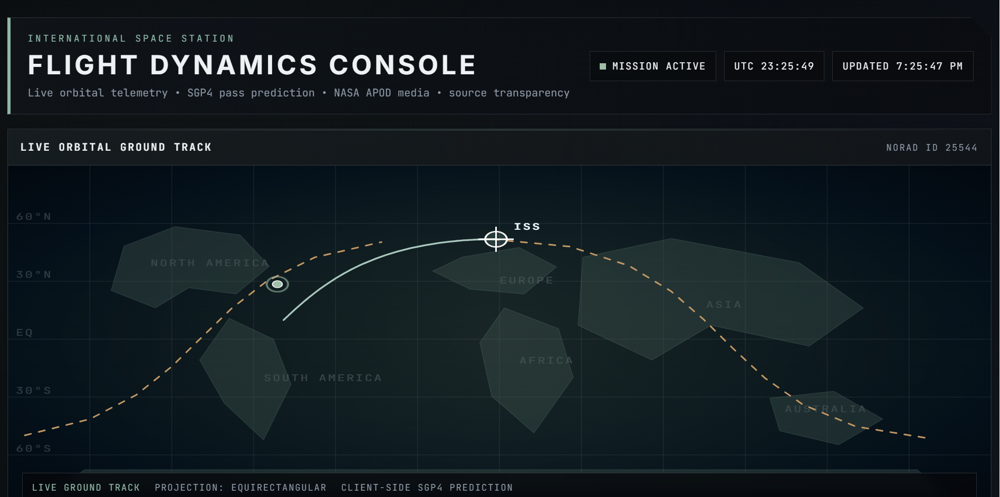
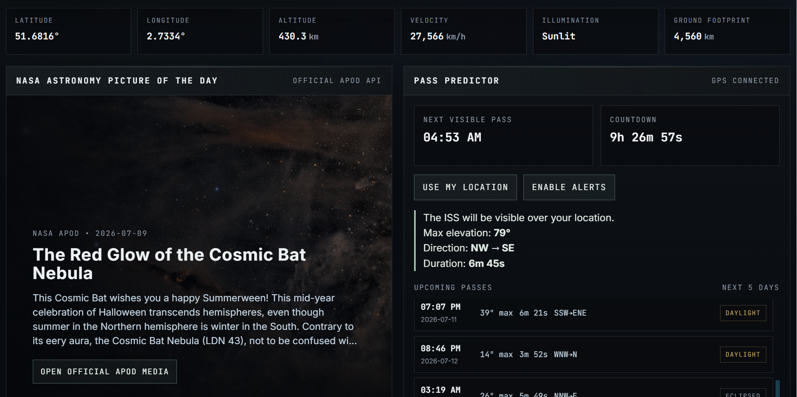
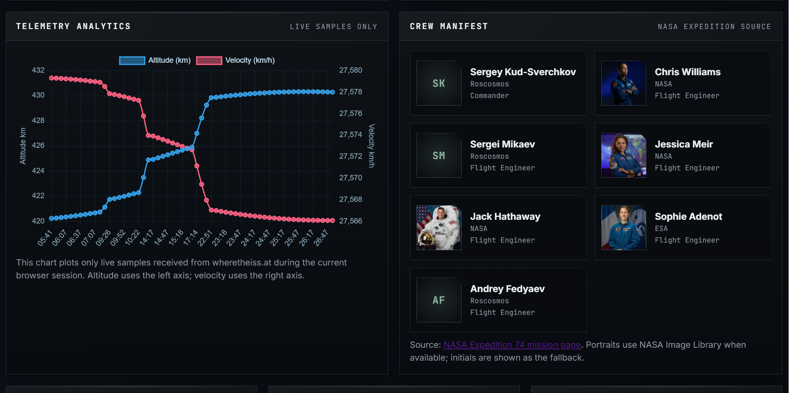
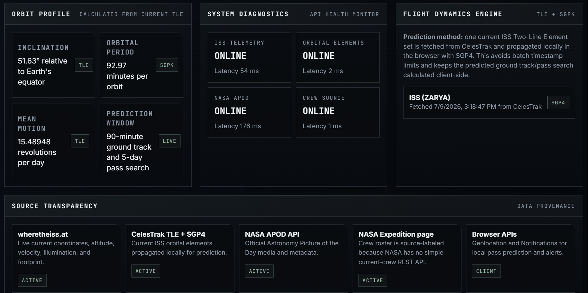
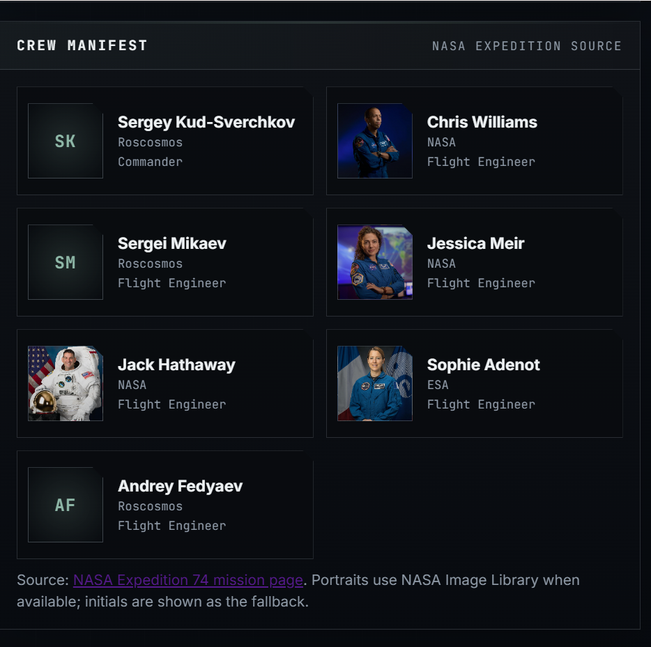
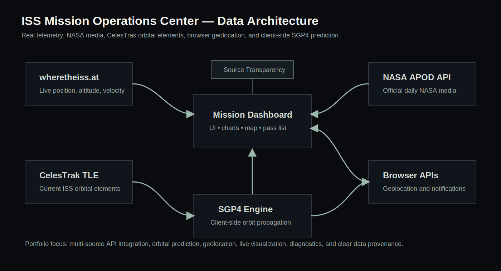

# ISS Mission Operations Center

Aerospace-inspired mission dashboard for visualizing the International Space Station using live telemetry, NASA mission media, CelesTrak orbital elements, client-side SGP4 propagation, browser geolocation, and live data visualization.

## Live Demo

https://emiliasingleton0.github.io/iss-mission-ops-map/

## Demo

## Features

- Live ISS latitude, longitude, altitude, velocity, illumination state, and ground footprint
- Large orbital ground-track visualization with observed trail and 90-minute SGP4 prediction
- Weekly pass predictor using the browser Geolocation API
- Pass visibility analysis with elevation, direction, duration, daylight/eclipsed status, and countdown
- NASA Astronomy Picture of the Day using NASA's official APOD API
- Crew manifest sourced from NASA Expedition information, with portraits where available
- Telemetry analytics using live browser-session samples
- Orbit profile derived from current CelesTrak TLE data
- System diagnostics with API status and latency checks
- Source Transparency section explaining where every dataset comes from

## Screenshots

### Orbital Ground Track

### NASA APOD + Pass Predictor

### Telemetry Analytics + Crew Manifest

### Source Transparency

### Crew Manifest

## Used

- HTML5
- CSS3
- JavaScript ES6+
- Chart.js
- satellite.js / SGP4
- SunCalc.js
- NASA APOD API
- CelesTrak TLE data
- wheretheiss.at telemetry API
- Browser Geolocation API
- Browser Notifications API
- GitHub Pages

## Data Architecture

| Feature | Source | Purpose |
|---|---|---|
| Live telemetry | wheretheiss.at | Current ISS coordinates, altitude, velocity, illumination, and footprint |
| Orbital elements | CelesTrak | Current ISS Two-Line Element set for NORAD ID 25544 |
| Orbit prediction | SGP4 via satellite.js | Client-side 90-minute ground-track and pass prediction |
| NASA media | NASA APOD API | Official Astronomy Picture of the Day |
| Crew roster | NASA Expedition source | Crew manifest with clear source labeling |
| User location | Browser Geolocation API | Local ISS pass prediction |
| Alerts | Browser Notifications API | Optional pass notifications |

## Source Transparency

This project separates official data from calculated prediction data.

**Official supported data:**

- Live ISS coordinates, altitude, velocity, illumination, and footprint
- Official NASA APOD media
- CelesTrak orbital elements
- Browser geolocation

**Calculated data includes:**

- 90-minute ground-track prediction
- Pass visibility
- Azimuth/elevation
- Countdown to next visible pass
- Orbit profile values derived from the current TLE

The calculated values are computed in the browser using current orbital data and SGP4 propagation

## Author

Emilia Singleton,
Information Technology student at the University of Central Florida
